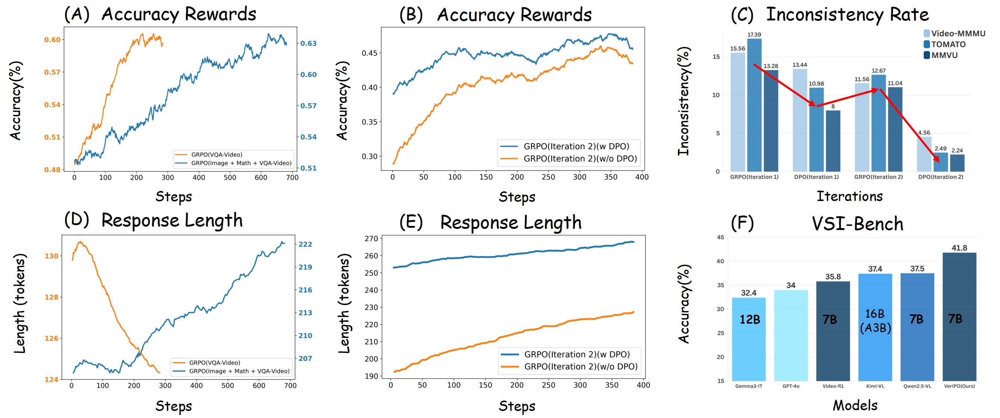
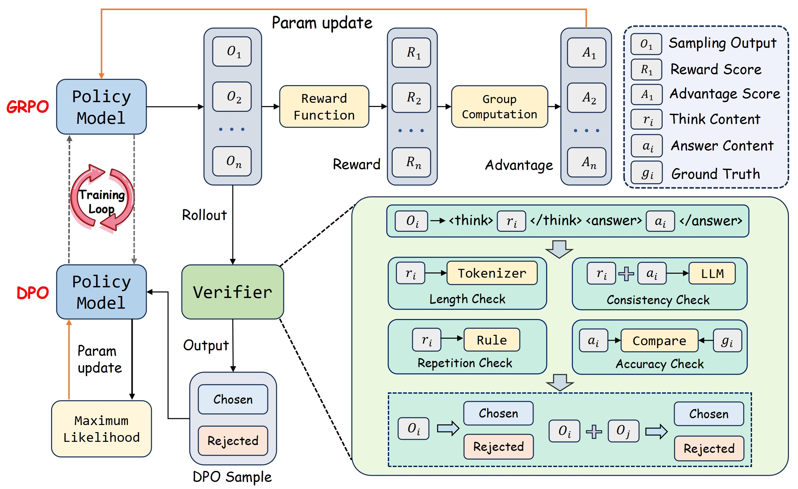

# VerIPO: Long Reasoning Video-R1 Model with Iterative Policy Optimization

[[📄 Paper Link](https://arxiv.org/abs/2505.19000)] 

The datasets, codes, and model checkpoints will be released soon.

## 1. Overview

Popular Reinforcement Fine-Tuning (RFT) methods, e.g., Group Relative Policy Optimization (GRPO), are limited by data preparation bottlenecks (e.g., noise or high cost) and exhibit unstable improvements in the quality of long chain-of-thoughts (CoTs) and downstream performance. 

To address these limitations, we propose **VerIPO**, a Verifier-guided Iterative Policy Optimization method designed to gradually improve video LLMs' capacity for generating deep, long-term reasoning chains.  The core component is *Rollout-Aware Verifier*, positioned between the GRPO and Direct Preference Optimization (DPO) training phases to form the GRPO-Verifier-DPO training loop. This verifier leverages small LLMs as a judge to assess the reasoning logic of rollouts, enabling the construction of high-quality contrastive data, including reflective and contextually consistent CoTs. These curated preference samples drive the **efficient DPO stage (7x faster than GRPO)**, leading to marked improvements in reasoning chain quality, especially in terms of length and contextual consistency. **This training loop benefits from GRPO's expansive search (Exploration) and DPO's targeted optimization**. 

Experimental results demonstrate: 1) Significantly faster and more effective optimization compared to standard GRPO variants, yielding superior performance; 2) Our trained models **exceed the direct-answer large-scale instruction-tuned Video-LLMs**, producing long and contextually consistent CoTs on diverse video reasoning tasks; and 3) Our model with one iteration outperforms powerful LMMs (e.g., Kimi-VL) and long reasoning models (e.g., Video-R1), highlighting its effectiveness and stability.



Figure 1: **Experimental Findings**. Figures (A, D): Initial GRPO training with different data types shows only utilizing Video-QA data decreases response length. Figures (B, E): Continual GRPO training with/without Verifier-guided DPO (VerIPO) demonstrates VerIPO improves accuracy and response length. Figure (C): **Inconsistency rate (thinking vs. final answer)** at different stages reveals our method lowers contextual inconsistency of long CoTs while GRPO increases it. Figure (F): Performance on challenging video reasoning dataset VSI-Bench [81] shows VerIPO (trained with Qwen2.5-VL-7B) outperforms strong LMMs including GPT-4o [23], Video-R1 [18], and Kimi-VL [61].


## 2. Approach



Figure 2: **Overview of VerIPO workflow**. This training loop is guided by the Verifier's continuous evaluation and selection of training samples. The optimization process progressively improves the model's long-term reasoning capability by learning from high-quality and informative reasoning examples.

The training loop follows a curriculum learning approach to activate the LMMs' long-term reasoning ability in video gradually. This begins with simple-modality data (text-only or image QA) for initial **reasoning activation** with GRPO, followed by the GRPO training using image and video QA data, as shown in the following Table.


Table 1: Training data and hyperparameters across different stages.

| Stage                   | Reasoning Activation | Group-Slow-Search | Pair-Fast-Align | Group-Slow-Search |
|-------------------------|----------------------|-------------------|-----------------|-------------------|
| **Algorithm** | GRPO                 | GRPO              | DPO             | GRPO              |
|       |  Long Document (1k) |        Science-Image (4K)            |                 |                   |
|  **Data**       |  Math-Text (30k)  |        Spatial-Image (9k)            |                 |                   |
|    |  Reasoning-Image (39K) |     General-Image (10K)   |    Rollouts of   |           VQA-Video       |
|                         |       |    VQA-Video (24K)      |        VQA-Video         |                 |
| **Gloabl Batch Size** | 128                  | 64                | 32              | 64                |
| **Rollout Batch Size** | 64                   | 64                | -               | 64                |
| **Learning Rate** | 1e-6                 | 1e-6              | 5e-7            | 5e-7              |
| **Rollout Responses Per Query** | 8                  | 8                 | -               | 8                 |
| **Sampling Temperature**| 1.0                  | 1.0               | -               | 1.0               |
| **DPO Beta ($\beta$)** | -                    | -                 | 0.1             | -                 |


Then, the whole GRPO-Verifier-DPO pipeline continuously enhances the model's long-term reasoning capability and gradually stabilizes its performance on video reasoning, iteratively pushing towards the model's inherent reasoning limit. During the iterative process, we will gradually discard 80\% of the simple examples ($r_a^{avg}=1$) from the previous GRPO training process to reduce the training time of models. The entire training process equips LMMs with robust long-chain reasoning ability with **slow-search GRPO (Wide Exploration) and fast-align DPO (Targeted Optimization)**.

## 3. Discussion

**Why do RL-trained LMRMs struggle to achieve consistent performance increase in all Video tasks?**

*1) High-Quality and Diverse Video Reasoning Data (Verifiable Data)*: 
Training LMRMs with RL requires vast amounts of high-quality data, particularly for video reasoning tasks that demand strong reasoning abilities or involve long reasoning paths. Most existing video datasets are primarily focused on simple recognition or short-term actions, lacking the complexity and scale needed for robust RL training.

*2) Model Capability Limitations in Video Understanding (Foundation Models)*: 
The base model, upon which LMRMs are built, often relies on pre-training methodologies that are not ideally suited for comprehensive video understanding, especially over long durations. While these foundation models excel at learning powerful representations from vast amounts of image-text pairs or short video clips, their pre-training objectives typically do not fully capture the nuances of long-range temporal dependencies, event causality and sequence, and contextual consistency over time.

*3) Cold Start Problem (Data Quality)*: 
If RL is used for fine-tuning after a supervised fine-tuning (SFT) phase, a poor initial SFT policy (especially for video) can hinder the RL agent's ability to explore effectively and find optimal policies. 


**Why do direct-answer models outperform long-thinking model variants?**

*1) Instability and sensitivity of RL training*: 
The inherent instability of RL can make ``long-thinking" approaches particularly challenging to optimize for long visual inputs (video). RL training for long-thinking models is hampered by their expansive "action space", which makes efficient exploration difficult and can lead to getting stuck in suboptimal solutions. This complexity also exacerbates hyperparameter sensitivity, a common RL challenge, risking training instability. Direct-answer models benefit from a smaller output space, simplifying both exploration.

*2) Not all prompts require thinking (\underline{Overthinking})*: 
The benefit of ``long-thinking" is task-dependent. For many common prompts, a direct answer is sufficient, and forcing a reasoning process can introduce unnecessary complexity, computational overhead, and potential thinking errors. We should build LMRMs to perform adaptive reasoning for different prompts.

*3) RL data size is limited*: 
The effectiveness of RL, especially for complex generative tasks, is highly dependent on the quantity and quality of data. The limitations in RL data directly impact the ability of long-thinking models to learn effectively.

**How to build an LMRM with adaptive reasoning capability?**

*1) Reasoning activation for different thinking patterns*: 
The reasoning activation stage should use diverse data, including direct-answer examples for conciseness, step-by-step reasoning examples for detailed thought processes, mixed modality reasoning to handle various input types, and reasoning-on-demand examples that prompt specific output styles. This multifaceted reasoning activation exposes the model to a range of reasoning strategies, preventing it from being confined to a single, rigid approach.

*2) Reward function for adaptive reasoning*: 
Effective RL fine-tuning for adaptive reasoning necessitates sophisticated reward functions beyond answer and format accuracy, e.g., including short, middle, or long thinking judge for different prompts. These should include composite rewards that value reasoning quality, conciseness, and coherence; efficiency-aware rewards that penalize overthinking on simple problems; and adaptive policy rewards that dynamically adjust based on problem complexity. Such nuanced signals guide the model to select the appropriate depth and style of reasoning for different prompts.

*3) Iterative optimization enhancement strategy*: 
The most effective development of adaptive reasoning in an LMRM may occur through an iterative optimization loop. This loop strategically blends enforced SFT, target-optimization DPO, and wide exploration GRPO, collectively allowing the model to progressively refine its capacity for selecting and executing the optimal reasoning strategy tailored to various video understanding tasks.


## 4. Citations

```bibtex
@article{li2025veripo,
  title={VerIPO: Cultivating Long Reasoning in Video-LLMs via Verifier-Gudied Iterative Policy Optimization},
  author={Li, Yunxin and Chen, Xinyu and Li, Zitao and Liu, Zhenyu and Wang, Longyue and Luo, Wenhan and Hu, Baotian and Zhang, Min},
  journal={arXiv preprint arXiv:2505.19000},
  year={2025}
}
```


